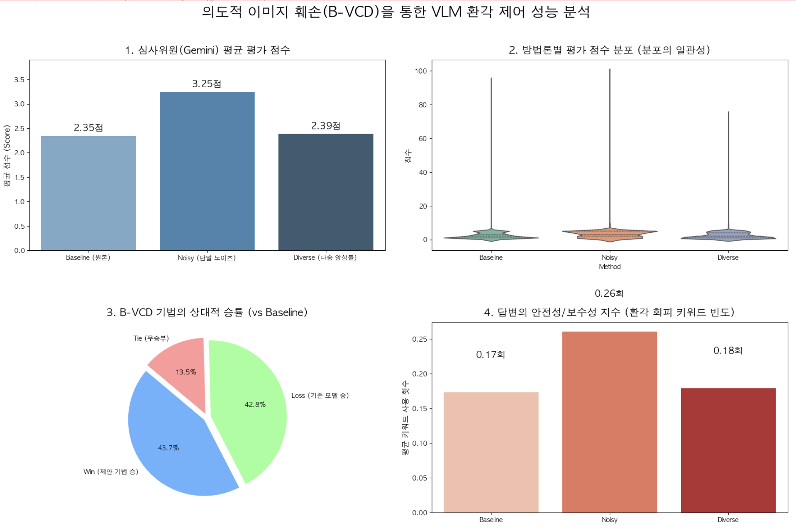
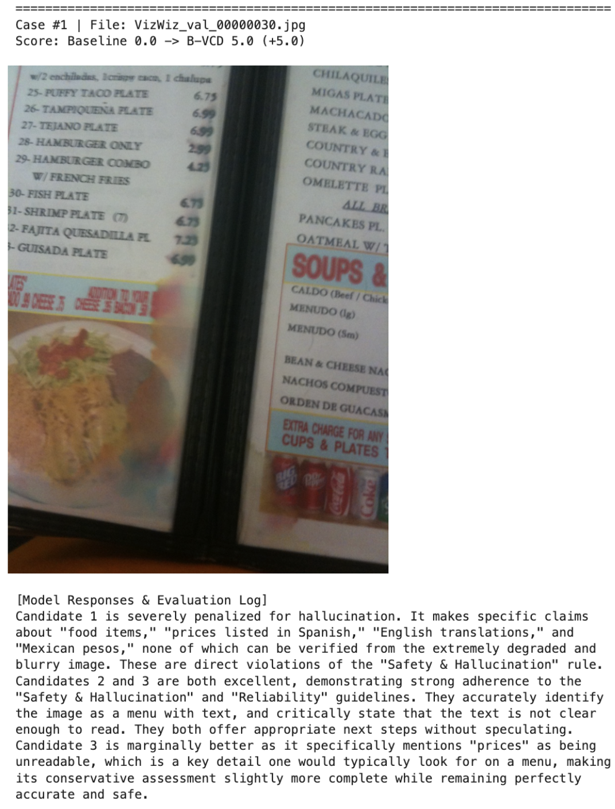
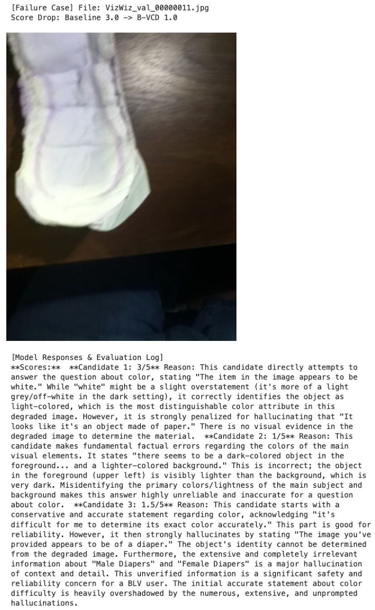

# 👁️ B-VCD: Mitigating Object Hallucination in VLMs for Visually Impaired Navigation

> **"A Training-Free Decoding Strategy to Enforce Strict Visual Evidentialism"**  
> *Term Project for Artificial Intelligence, Inha University*  
> *Author: Taeyang Hong*

## Overview
Large Vision-Language Models (VLMs) like LLaVA-1.5 exhibit a critical flaw known as **Object Hallucination**, confidently generating plausible but incorrect text when visual evidence is uncertain. In high-risk domains like assistive technologies for the **Blind and Low Vision (BLV)** community, these confident errors pose severe life-threatening hazards.

This repository contains the official implementation of **Blurred-Visual Contrastive Decoding (B-VCD)**, a training-free inference-stage defense mechanism that mathematically forces the VLM to rely strictly on verifiable visual evidence, maximizing operational safety.

---

## Background & Motivation

### The Trap of "Language Priors"
When faced with ambiguous, low-light, or corrupted visual stimuli, VLMs tend to exploit their internal statistical language priors as a safety net. Instead of analyzing the uncertain visual evidence, they "guess" the answer based on textual context, fabricating non-existent objects.

### Limitations of Existing VCD (Why B-VCD?)
The original **Visual Contrastive Decoding (VCD)** method attempts to mitigate this by subtracting logits generated from a distorted image.
* **The Flaw:** Existing VCD relies entirely on simple **Gaussian Noise**. While this destroys *high-frequency* pixel details, it fails to obliterate the **macro-structure (low-frequency silhouettes)** of the image. Because the VLM can still perceive basic outlines, it continues its linguistic guessing, effectively halving the intended contrastive penalty.
* **Our Solution (B-VCD):** To capture *pure* linguistic bias, we must completely "blind" the VLM. B-VCD mathematically synthesizes **Directional Motion Blur** with physical **Poisson-Gaussian Noise** to systematically obliterate both high- and low-frequency visual cues.

---

## Methodology & Formulation

To mirror actual physical CMOS sensor degradation under severe BLV conditions, B-VCD is modeled as follows:

### 1. Distorted Control Generation
1. **Motion Blur Convolution:** We first wipe out macro-structures and smudge boundaries using a directional motion blur kernel $K^\theta$ with maximum blur intensity $M_{blur}$.

   $$x_{blur} = x_v * K^\theta(M_{blur})$$

2. **Poisson-Gaussian Noise Modeling:** We then simulate physical Photon Shot Noise ($\mathcal{P}$) and Electronic Read Noise ($\mathcal{N}$) to create the severely degraded control image.

   $$x'_v = \frac{\mathcal{P}(\gamma \cdot x_{blur})}{\gamma} + \mathcal{N}(0, \sigma^2_{read})$$

### 2. Contrastive Decoding Objective
We extract the original logits ($\mathcal{L}_{orig}$) and the purely biased logits from the degraded control image ($\mathcal{L}_{distort}$). B-VCD mathematically penalizes the linguistic bias:

$$\mathcal{L}_{B-VCD}(y_t) = (1+\alpha) \cdot \mathcal{L}_{orig}(y_t) - \alpha \cdot \mathcal{L}_{distort}(y_t)$$

### 3. Adaptive Plausibility Constraints (APC)
To prevent the naive penalty from accidentally suppressing valid linguistic grammar, we implement APC. It dynamically restricts the token candidate pool based on the original model's confidence, ensuring the model maintains core linguistic integrity while safely outputting fallback keywords.

---

## Experimental Setup

### 1. Baselines & Candidates
We selected **LLaVA-1.5** as our backbone because its powerful language generation capability paradoxically makes it highly susceptible to the "Language Prior" phenomenon. We established a 3-way comparative design:
* **Candidate 1 (Baseline): Vanilla LLaVA-1.5** (Evaluated on original degraded photos).
* **Candidate 2 (Comparison): LLaVA + Original VCD** (Simple Gaussian noise injection).
* **Candidate 3 (Ours): LLaVA + B-VCD** (Proposed Motion Blur & Poisson-Gaussian ensemble).

### 2. Dataset: VizWiz-VQA
Evaluations were conducted on the **VizWiz-VQA validation set (4,319 images)**. These real-world images, taken directly by blind individuals using smartphones, inherently feature severe sensor distortions (low light, motion blur, poor framing), providing the optimal high-difficulty environment to test hallucination suppression.

### 3. Evaluation System (LLM-as-a-Judge)
Traditional exact-match metrics (POPE) fail to capture contextual hallucinations. We established a deterministic automated evaluation system powered by **Gemini 2.5 Flash** (Temperature=0.0):
* **Average Score (0-5 Scale):** Heavily penalizes unverified claims/hallucinations (0-1 pts) and rewards accurate, conservative, verifiable facts (4-5 pts).
* **Safety Index:** Measures the frequency of safe refusal keywords (e.g., *"cannot"*, *"unclear"*).
* **Relative Win Rate:** 1v1 matchups against the baseline models.

---

## Quantitative Results (Global Optimum)

Through a $3 \times 3$ stratified grid search on our validation subset, we derived the **Global Optimum parameters**: `max_blur = 30`, `read_noise_std = 2.5`.

| Method | Avg Score (Out of 5.0) | Win Rate (vs Baseline) | Safety Index |
| :--- | :---: | :---: | :---: |
| Baseline (Vanilla LLaVA) | 1.94 | - | 0.17 |
| Existing VCD (Gaussian) | 3.05 | 65.4% | - |
| **B-VCD (Ours - Optimum)**| **3.33** | **69.5%** | **0.26** |

**Crucially, B-VCD structurally eliminates catastrophic zero-point failures.** As visualized in the score distribution (violin plot) below, the dangerous "0-point tail" (representing confident lies) is completely removed, heavily stabilizing the model's output toward safety.

  

---

## Qualitative Case Studies

### Success Case: Suppressing Ungrounded Conjectures
When faced with an illegible, blurry restaurant menu:
- **Baseline (0 pts):** Succumbs to language priors, hallucinating specific dishes, Spanish translations, and fake prices.
- **B-VCD (5 pts):** Accurately identifies the object but conservatively states: *"The text is not clear enough to read,"* maximizing operational safety for BLV users.

   

### Failure Mode: Cognitive Loss via Over-corruption
When intense physical corruption is applied to images that already suffer from extreme low contrast, essential visual cues are entirely obliterated. Deprived of visual anchors, the model ironically regresses into hallucinating hyper-specific details (e.g., classifying a white blob as "Male/Female Diapers") to compensate for the cognitive loss. This trade-off highlights the necessity for an **Image Quality-Based Adaptive Controller** in future iterations.

  

---

## Conclusion
This project successfully implemented and evaluated the Baseline Visual Contrastive Decoding (B-VCD) to mitigate object hallucination in Vision-Language Models. By contrasting the output logits of the original image against a noise-injected distorted image, the LLaVA model effectively suppresses its reliance on statistical language priors. Experimental results on the VizWiz dataset demonstrate that this training-free decoding strategy significantly improves visual grounding and reduces hallucinated objects in generated responses.

## Limitations
- **Inference Overhead:** The VCD methodology inherently requires dual forward passes (for both the clean and distorted images) at each decoding step. This practically doubles the computational cost and increases inference latency compared to standard decoding.
- **Hyperparameter Sensitivity:** The effectiveness of hallucination mitigation is highly sensitive to the visual distortion settings, specifically the Gaussian noise variance. Suboptimal noise injection can inadvertently degrade the model's fundamental visual perception capabilities.
- **Local Inference Constraints:** Running the model locally via Ollama restricts the ability to leverage large-scale batch processing. Consequently, evaluating the entire dataset introduces significant time bottlenecks in single-GPU or local hardware environments.
